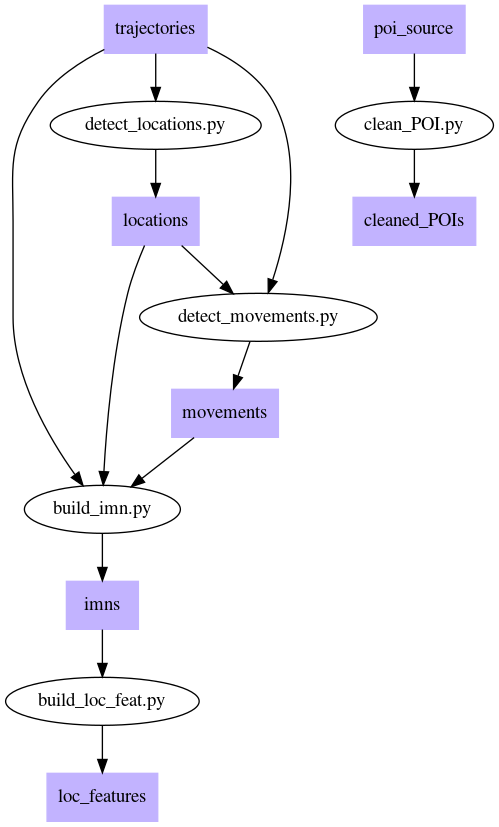

H2020 - Grant Agreement n. 780754

# Annotated Individual Mobility Network
This repository contains the code implementing the AIMN tool described in paper:

_Riccardo Guidotti, Mirco Nanni, Francesca Sbolgi. **Data-Driven Location Annotation for Fleet Mobility Modeling.**
In EDBT/ICDT Workshop on Big Mobility Data Analytics (BMDA 2020), CEUR, vol 2578, 2020. http://ceur-ws.org/Vol-2578/BMDA2.pdf_

## Basic functionalities of Python library ("python" folder) 
The core operation of the library is the computation of the locations of all vehicles and of the corresponding features. That passes through the building of the IMNs of each vehicle. The data flow is the following, where the shaded boxes represent data files. 
The input provided by the user are the trajectories and the poi_list. The output is a file containing all the locations and their corresponding features:

## Additional functionalities of Jupyter notebooks ("notebook" folder)
The notebooks provide some additional operations, including:
- the clustering of locations
- the visualization of annotated IMNs
- visualization of locations clusters -- both as plots and as maps

## Acknowledgement
This work is partially supported by the E.C. H2020 programme under the funding scheme Track & Know, G.A. 780754, [Track&Know](https://trackandknowproject.eu)
