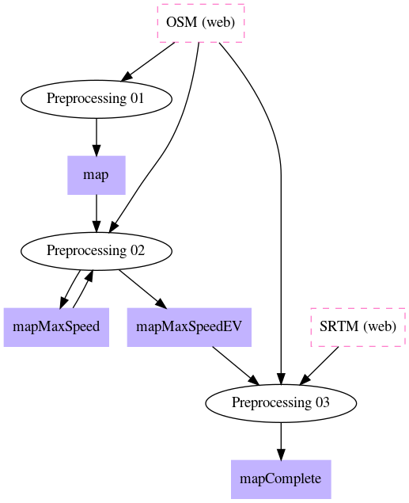
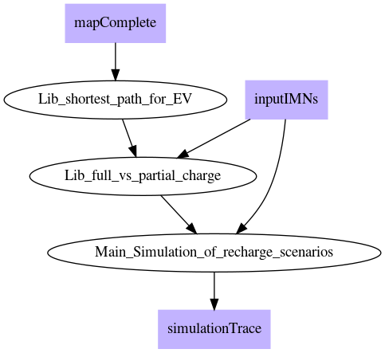
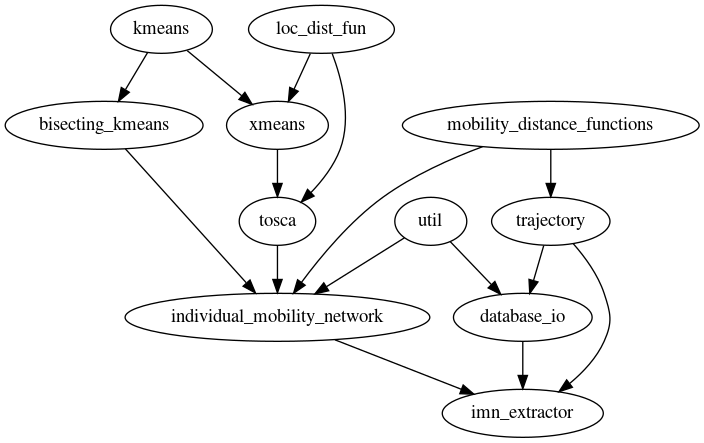

H2020 - Grant Agreement n. 780754

# Individual Electric Vehicle simulation
This repository contains the code implementing the EV simulation tool described in Track & Know deliverable D4.2:

_**Deliverabel D4.2 Analytics for individuals’ mobility networks**. https://trackandknowproject.eu/_

and in MS thesis works:

_Shadi Shajari. **Simulating individual mobility Network for Electric Vehicles.**
In Electronic theses and dissertations repository of University of Pisa: https://etd.adm.unipi.it/theses/available/etd-04162020-104021/_

_Francesco Rallis. **Trip planning methods for electric vehicles (in Italian).**
In Electronic theses and dissertations repository of University of Pisa: https://etd.adm.unipi.it/theses/available/etd-09152019-025908/_

## Preprocessing 
Before performing simulations, a three-step one-shot preprocessing procedure needs to be performed, that loads the road network of the area we need and enriches it with information about recharge stations, speed limits, elevation and estimate battery consumption of each road segment.
The process is implemented with Python notebooks that need to be edited to fit different datasets and geographical areas.
The data workflow is the following (squares = data/web sources, ellipses = source code):

## Main simulation
The main simulation is implemented by a Python notebook (_Main\_Simulation\_of\_recharge\_scenarios.ipynb_), that loads individual data in form of Individual Mobility Networks and makes use of the maps computed in the preprocessing.
The data workflow is the following:

## Libraries
Finally, the operations described above are based on various functionalities implemented as Python files.
Their dependencies are shown below:

## Acknowledgement
This work is partially supported by the E.C. H2020 programme under the funding scheme Track & Know, G.A. 780754, [Track&Know](https://trackandknowproject.eu)

